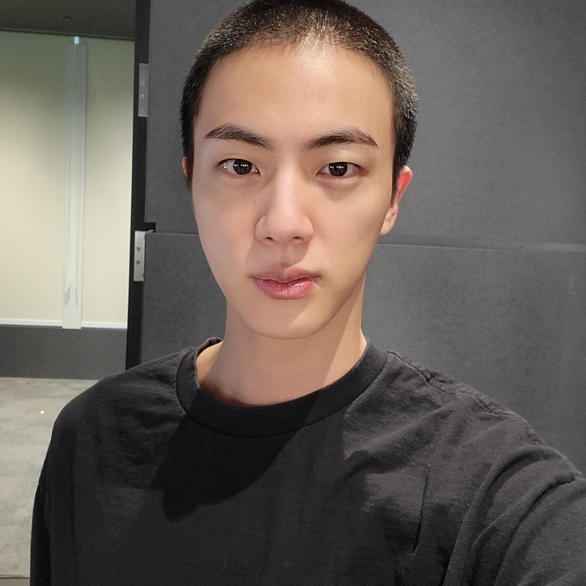
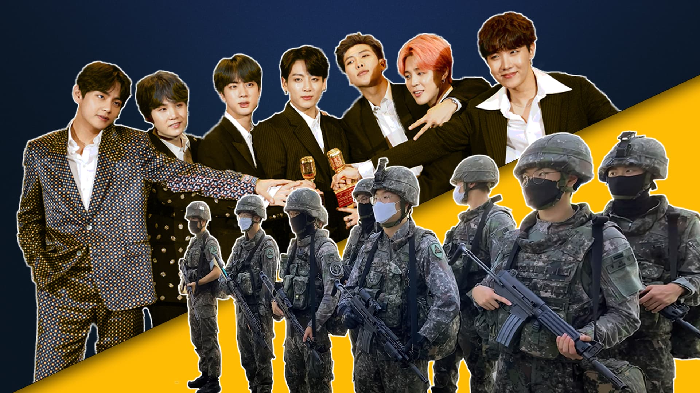
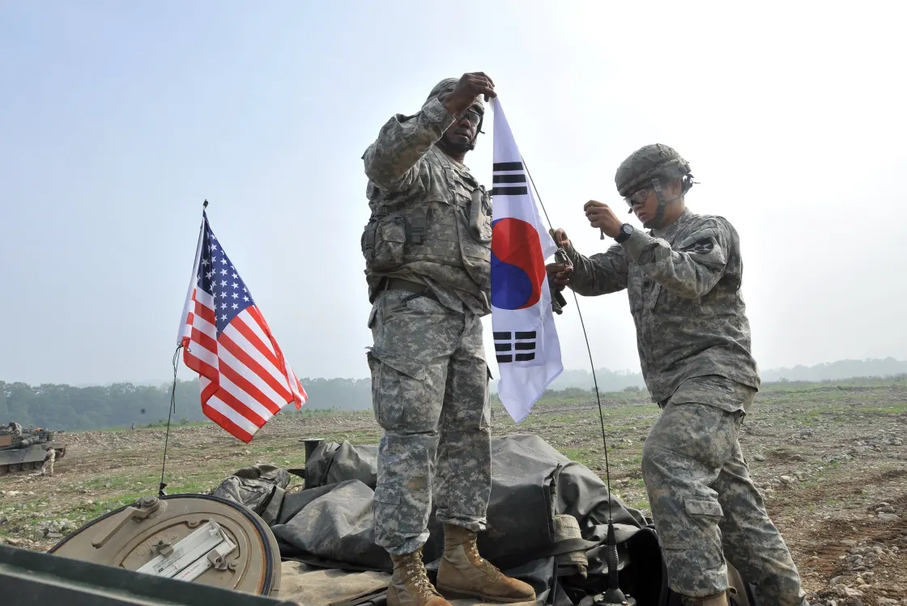
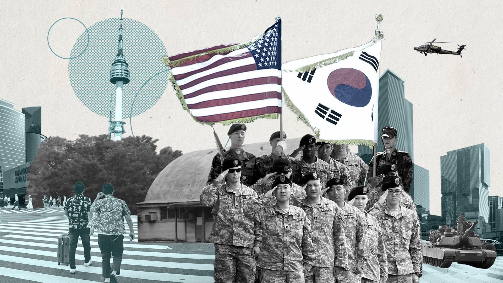

## Introduction

On a snowy day in December of last year, Jin, the oldest member
of BTS, entered his assigned military boot camp, located close to
the border between the two Koreas. Two days before his
enlistment, he uploaded a picture of his military buzz cut—a
requirement for all enlistees—to Weverse, a platform that
connects BTS to their global fanbase, ARMY. The photo launched a
frenzy of discourse on the internet: Twitter mutuals and fellow
ARMY of mine weighed in on the issue, lamenting the reality of
having to wait until 2025 for all of the members to complete
their military service. With Jin’s departure, much of the world
became aware of South Korea’s policy of universal male
conscription for the first time.

South Korea not only mandates military service of at least 18
months for all cis, able-bodied men ages 18 to
35,^[https://time.com/6265842/south-korea-birth-rate-military-service-exemption/]
but is also one of the few remaining countries whose high courts
do not acknowledge the right of conscientious objection—the
government has sent more than 10,000 conscientious objectors to
prison since 2000.^[Yezi Yeo, “The Good, the Bad, and the
Forgiven: The Media Spectacle of South Korean Male Celebrities’
Compulsory Military Service,” _Media, War & Conflict 10, no. 3
(2017): 295. https://www.jstor.org/stable/26392782.] Failing to
fulfill one’s military duty is highly stigmatized and scorned
upon by the rest of society.^[Ibid.]

Jin’s enlistment—and BTS’s official announcement of their
intention to serve in October of last year—came after years of
debate among politicians and Korean citizens regarding who should
be exempted from what is commonly framed as the “passport to male
adult life in Korean society.”^[Seungsook Moon, “Trouble with
Conscription, Entertaining Soldiers: Popular Culture and the
Politics of Militarized Masculinity in South Korea,” _Men and
Masculinities_ 8, no. 1 (2005): 72.
https://doi-org.eres.library.manoa.hawaii.edu/10.1177/1097184X04268800]
As of now, South Korean law gives special exemptions to
high-performing athletes and classical musicians and dancers if
they have won top prizes of international prestige. Yet, K-pop
stars and other entertainers (e.g. rappers, actors) are not given
such benefits, and high-profile individuals are regularly accused
of evading the
draft.^[https://koreajoongangdaily.joins.com/2023/03/13/national/socialAffairs/korea-military-military-service/20230313193813729.html]

Following BTS’s announcement to enlist in October of last year,
media outlets, politicians, and social media users all praised
the group’s willingness to serve the nation. In its official
press release, Big Hit Music, BTS’s parent company, announced
that in “respect[ing] the needs of the country,” it was necessary
for “these healthy young men to serve with their
countrymen.”^[https://twitter.com/BIGHIT_MUSIC/status/1581905317545533440?s=20]
Yet, what does this language surrounding national duty say about
the ties between military service and masculinity? What do public
reactions to those forgoing or dodging the draft say about who is
considered “man” enough? How did the draft come to be an
inescapable and inevitable part of Korean male adulthood? The
structures we take for granted were intentionally created to
serve a specific purpose, oftentimes more recently than we may
think.

While so many BTS fans were quick to express their sadness and
outrage over their favorite idols being sent to the army, I
noticed that there was little criticism of the process of
enlistment as a whole—of the realities that make military service
in South Korea mandatory for men in the first place. The only
critical reading of South Korea’s draft in relation to BTS that
reached a wide audience was by Nodutdol, a leftist Korean
diasporic organization, which published a
thread^[https://twitter.com/nodutdol/status/1602698541922750465?s=20]
on the history behind mandatory military service and its ties to
U.S. imperialism.

BTS is fulfilling their national duty—but is this really
something to celebrate?

## A brief history of militarism in Korea

To understand and critique the realities of universal male
conscription in Korea, it is first necessary to examine the
following circumstances faced by South Korea: national division,
the Korean War, prolonged military confrontation, and fervent
anticommunism.^[Seungsook Moon, _Militarized Modernity and
Gendered Citizenship in South Korea_ (Durham: Duke, 2005), 48.]
Following 35 years of colonialism under the Japanese Empire, the
South Korean state was established in 1948 by the U.S.
military-backed, conservative landed class, while North Korea was
supported by the Soviet Union. By then, tens of thousands of U.S.
servicemen had already arrived on the southern half of the
peninsula. From 1950 to 1953, the North and South fought in what
was essentially a proxy war between the U.S. and the Soviet
Union, marking the height of the Cold War. The Korean War
solidified the nation’s division at the 38th parallel, an
arbitrary line that was drawn by two U.S. military officers.
While the war ended in an armistice agreement between the United
Nations (a proxy for the U.S.), North Korea, and China, without
any formal peace treaty, the two Koreas are technically still at
war.

In the years of state-building following the Korean War,
anti-communist ideology—espoused by the U.S. military and
conservative Korean elite —formed the bedrock of national
identity in the South. A military regime that would protect
citizens against the threats posed by the communist North was
considered necessary for national security. Thus, mandatory
military service for all men was implemented in 1957, during the
early years of South Korea’s path to modernity.

Military violence thus made possible the conditions for all
subsequent creations of Korean sociopolitical life. Scholar
Seongsook Moon calls this “militarized modernity.” Militarized
modernity, a sociopolitical and economic formation that emerged
in South Korea during the decades following the Korean War,
denotes a trend of modernity characterized by the fusion of
disciplinary power and pervasive force. In the case of South
Korea, the pursuit of modernity included the anticommunist
state’s attempt to remold its population into “useful members of
the body politic through the combined use of discipline and
physical violence.”^[Moon, _Militarized Modernity_, 51.] This
“remolding” was most clearly seen through the mobilization of
manpower through universal male military conscription, a practice
that is also seen in the North (and to a much more intense
degree).^[https://www.statista.com/chart/29057/length-of-mens-compulsory-military-service/]
Thus, a lasting repercussion of Korea’s continued division is
active militaries on both sides of the DMZ. Notably, the U.S.
commander has full wartime control over South Korea’s
military.^[https://carnegieendowment.org/2019/08/21/why-doesn-t-south-korea-have-full-control-over-its-military-pub-79702]

## Problems within the military today

Today, many South Korean young men no longer resonate with the
belief that it is a man’s national duty to counter communism by
enlisting.^[https://www.nytimes.com/2021/10/17/world/asia/south-korea-conscription.html]
Yet, mandatory military service remains deeply ingrained in
Korean notions of masculinity and national identity. Many people
still believe that universal male conscription is an equalizer of
sorts—men of all socioeconomic backgrounds are required to serve
for the same amount of time. This is a myth of fairness. As Moon
argues, there are abundant examples of military service
corruption among the wealthy and powerful in South Korea.^[Moon,
“Trouble with Conscription,” 74.] Supplemental, or non-active
service, is perceived as a less onerous route to fulfilling
military service and is common among sons of upper-class families
who use their money and connections to avoid active military
service. Furthermore, college education has historically
functioned as a path to deferring the draft, leading to more
class-based equity problems when it comes to universal
conscription.^[Ibid., 73-74.] Those who advocated for BTS’s
enlistment claim that it is a duty that is expected of all Korean
men—yet, it is clear that enlistment was never a truly
standardized practice to begin with.

For celebrities, especially, one’s completion of mandatory
military service demonstrates the achievement of a specific,
patriotic ideal of manhood. In her piece “The good, the bad, and
the forgiven: The media spectacle of South Korean male
celebrities’ compulsory military service,” scholar Yezi Yeo
discusses the social meanings behind male conscription through
the lens of high-profile celebrity cases, claiming that “these
media scandals reinforce what it means to be a true ‘Korean
man.’”^[Yeo Yezi, “The Good, the Bad, and the Forgiven,” 293.]
From the notorious case of Seungjun Yoo, who gave up his Korean
nationality in order to free himself from conscription, which led
to the government banning Yoo’s entry to South Korea
indefinitely, to the controversy surrounding global star Psy’s
alleged “undutiful” military service performance and his decision
to enlist twice in order to boost his public image, it is clear
that both South Korean manhood and citizenship are sanctified by
the sacred duty to serve.^[Ibid., 301.] Perceptions of this
sacred duty relies on gendered assumptions about who (cis men) is
to protect whom (women: mothers, lovers, etc.) and against whom
(the communist North).^[Moon, “Trouble with Conscription,” 67.]

In maintaining these strict gender-based policies, the South
Korean military regime further marginalizes populations that do
not conform to the system’s rigid ideas and assumptions about
manhood. In order to maintain a “cult of tough and aggressive
masculinity,” conscripts are constantly subjected to disciplinary
abuse designed to inculcate a masculinity characterized by
toughness, aggression, and obedience.^[Ibid., 72.] The South
Korean military culture is notorious for being strict, and at
times, violent: in 2014, a conscript was beaten to death by
higher-ranking
officials.^[https://restofworld.org/2021/the-most-dangerous-weapon-in-south-koreas-military-is-a-smartphone/,
https://www.bbc.com/news/world-asia-58660760] In a country that
does not legally accept same-sex partnerships, the military
regime is particularly abusive towards LGBTQ+ individuals. Under
military law, LGBTQ+ soldiers are banned from same-sex relations
and can face up to two years in prison if caught. Transgender
soldiers are banned from serving: in 2021, the defense ministry
declared gender affirming surgery a mental or physical
handicap.^[https://www.theguardian.com/world/2021/mar/04/south-koreas-first-transgender-soldier-found-dead]
The oppressive rigidity of the system and the clear gender
bifurcation arising from universal male conscription should
prompt us to question the legitimacy of the military in the first
place.

## Conclusion

Whose interests does universal male conscription serve, and what
history does this practice carry with it? These are just a few of
the questions we must begin to ask when thinking critically about
the draft and the power wielded by outside forces in
Korea.^[https://www.reuters.com/world/asia-pacific/home-28000-us-troops-skorea-unlikely-avoid-taiwan-conflict-2022-09-26/]
Militarized masculinity is a concept not only relevant to
conscription: it has far-reaching effects in Korean society. The
consequences of the gender bifurcation resulting from a universal
male draft—and claims of the draft promoting anti-male
discrimination—can be seen everywhere, from the rise of misogyny
among young South Korean men (as seen through the rise of a men’s
alt-right movement on platforms such as
Ilbe)^[https://www.mic.com/articles/184477/inside-ilbe-how-south-koreas-angry-young-men-formed-a-powerful-new-alt-right-movement]
to the way female K-pop idols are expected to perform for the
male
gaze.^[https://www.theatlantic.com/international/archive/2012/01/whats-behind-the-video-of-korean-soldiers-freak-out-over-girl-group/251212/]
The military regime is not isolated. Rather, it is a vessel
through which ideas regarding gender, sexuality, and nationalism
percolate into broader society.

I implore anyone who is to some extent invested in Korea, whether
you are a second generation Korean American attempting to grasp
more of your homeland’s history or an avid K-pop fan, to do more
than just consume the culture—the BTS, the k-dramas, the skincare
routines—and find ways to critically engage with and ask
questions about issues like Jin’s military service. After all,
the history of militarism on the Korean peninsula is one that
implicates over twenty other
nations^[https://www.unc.mil/History/1950-1953-Korean-War-Active-Conflict/#:~:text=During%20the%20Korean%20War%20and,under%20the%20United%20Nations%20flag.]—and
by extension, those who call these places home. This piece is far
from a complete overview. We direct you to the following sources
and perspectives to learn more about the draft, its history, and
its implications:

- _Militarized Modernity and Gendered Citizenship in South Korea_,
Seungsook Moon
- _The Origins of the Korean War: Liberation and the emergence of separate regimes, 1945-1947_, Bruce Cumings
- _The Unforgiven_ (independent film, 2005)
- _D.P._ (TV series, 2021)
